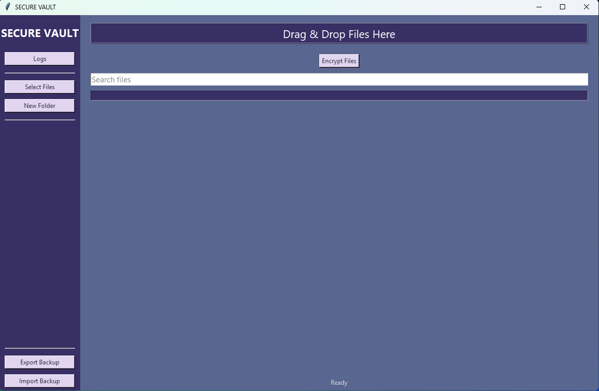
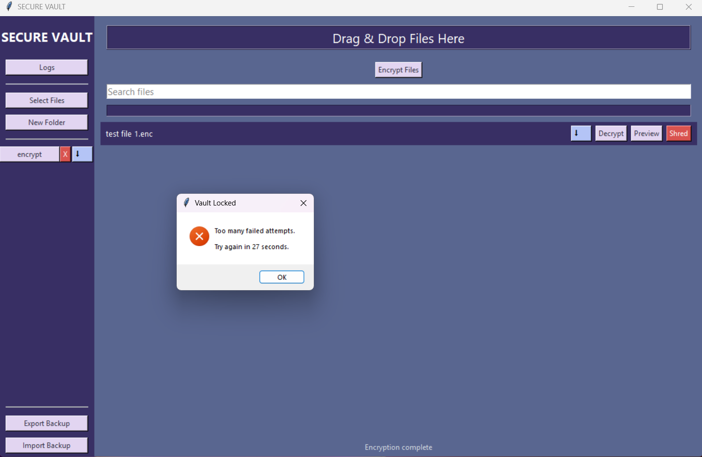
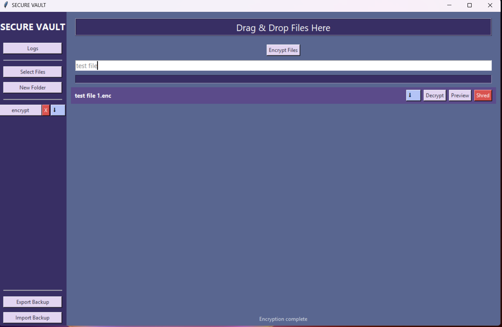
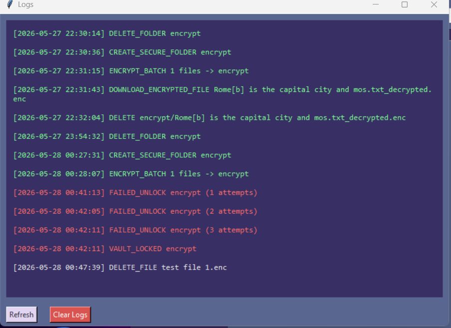
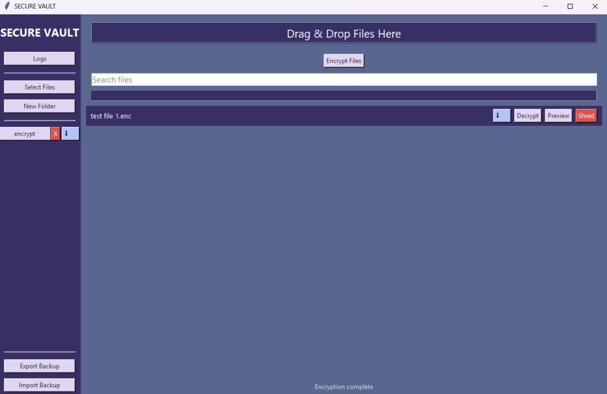

# SecureVault
### Security Beyond Encryption

SecureVault is a desktop-based encrypted file management system designed to securely store, organize, encrypt, and protect sensitive digital files. The application combines a Python-based graphical interface with a C-powered encryption backend using OpenSSL cryptography libraries.

The project was built to address unauthorized access, accidental data leaks, insecure local storage, and weak file protection systems through modern encryption and security-focused system design. <br>
# Product Overview

SecureVault provides users with a secure desktop vault environment for handling confidential files locally while maintaining strong cryptographic security and usability.

The system integrates:
- AES-256-GCM authenticated encryption
- PBKDF2-HMAC-SHA256 password key derivation
- Intrusion detection systems
- Secure file shredding
- Encrypted backup export and recovery
- Real-time encryption tracking. <br>
# UN Sustainable Development Goal Alignment

## SDG 9 — Industry, Innovation and Infrastructure

SecureVault promotes secure and reliable digital infrastructure by providing a modern encrypted file management system focused on privacy, cybersecurity, and secure local data storage. The project combines modular software architecture, cryptographic security, and responsive desktop engineering practices to encourage safer digital environments and stronger cybersecurity awareness.

## SDG 16 — Peace, Justice and Strong Institutions

SecureVault supports secure digital information management by helping users protect sensitive files against unauthorized access, brute-force attacks, accidental exposure, and insecure deletion practices through modern encryption and security-focused system design

# Core Features
- AES-256-GCM authenticated encryption
- PBKDF2-HMAC-SHA256 key derivation
- Randomized salts and initialization vectors
- Intrusion detection logging
- Temporary vault lockouts
- Secure file shredding
- Encrypted backup export and recovery
- Live file search and filtering
- Real-time encryption progress tracking
- Drag-and-drop uploads
- Threaded encryption engine
- Modular feature-based architecture <br>
# System Architecture
``` text
Tkinter GUI
      ↓
Python Application Layer
      ↓
C Encryption Backend
      ↓
OpenSSL AES-256-GCM Engine
```
The Python interface manages user interaction, vault operations, and application workflows, while the C backend performs cryptographic processing through OpenSSL for improved performance and security. <br> 
# Technologies Used

| Technology | Purpose |
|------------|---------|
| Python | GUI and application logic |
| Tkinter | Desktop graphical interface |
| C | Cryptographic backend |
| OpenSSL | AES-GCM and PBKDF2 cryptography |
| PyInstaller | Standalone executable packaging |
| MinGW GCC | C compilation | <br>

# Installation Guide
### Method 1 — Installer
* Download SecureVault_Setup.exe from Releases
* Run the installer
* Launch SecureVault from Desktop or Start Menu
* If Windows SmartScreen appears, click: More Info → Run Anyway 
## Method-2: Clone Repository

```bash
git clone https://github.com/yourusername/securevault.git
```

```bash
cd securevault
```

---

## Build Encryption Backend

```bash
mingw32-make clean
```

```bash
mingw32-make
```

This generates:

```text
build/encryptor.exe
```

---

## Install Dependencies

```bash
pip install -r requirements.txt
```

---

## Run Application

```bash
python gui/app.py
```

---

# To Package with PyInstaller

## Remove Old Builds

```powershell
Remove-Item -Recurse -Force dist
```

```powershell
Remove-Item -Recurse -Force build
```

```powershell
Remove-Item -Force *.spec
```

---

## Generate Executable

```powershell
pyinstaller --onefile --windowed --icon=svicon.ico gui/app.py
```

---

## Copy Encryption Backend

```powershell
Copy-Item build\encryptor.exe dist\encryptor.exe
```

---

# The Security Highlights

## Cryptographic Security

- AES-256-GCM authenticated encryption
- PBKDF2-HMAC-SHA256 key derivation
- Randomized salts and IVs
- Authentication tag verification
- Tamper detection during decryption

## System Security

- Intrusion detection logs
- Temporary vault lockouts
- Password strength analysis
- Secure file shredding
- Encrypted backup portability <br>

# Some Optimization Highlights

- Modular feature-based architecture
- Background threaded encryption
- Responsive real-time progress tracking
- Faster C/OpenSSL cryptographic backend
- Standalone desktop packaging
- Organized logging and live search systems <br>
# 📁 SecureVault Screenshots

## 🖥️ DASHBOARD


---

## 🔐 VAULT LOCKOUT PROTETCTION


---

## 🔍 LIVE FILE SEARCH


---

## 📜 INTRUSION DETECTION LOGS


---

## 📊 ENCRYPTION TRACKING PROGRESS



# Contributors

This application was created in collaboration with Faizah Hafeez (@faizahhafeez2-code), Sakina Fatima Mirza (@sakinastlw110), and myself (@silasiel) under the team name *Cipher Syndicate* for a junior-level technical competition conducted by our college. <br>

# License
This project is licensed under the MIT License.
