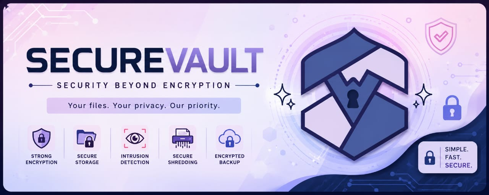
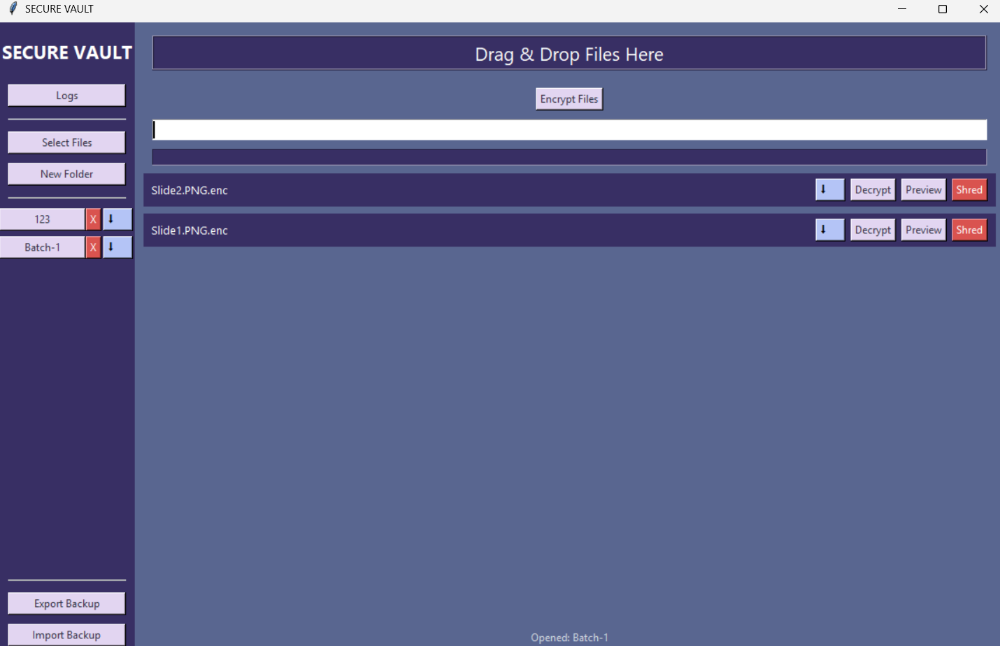
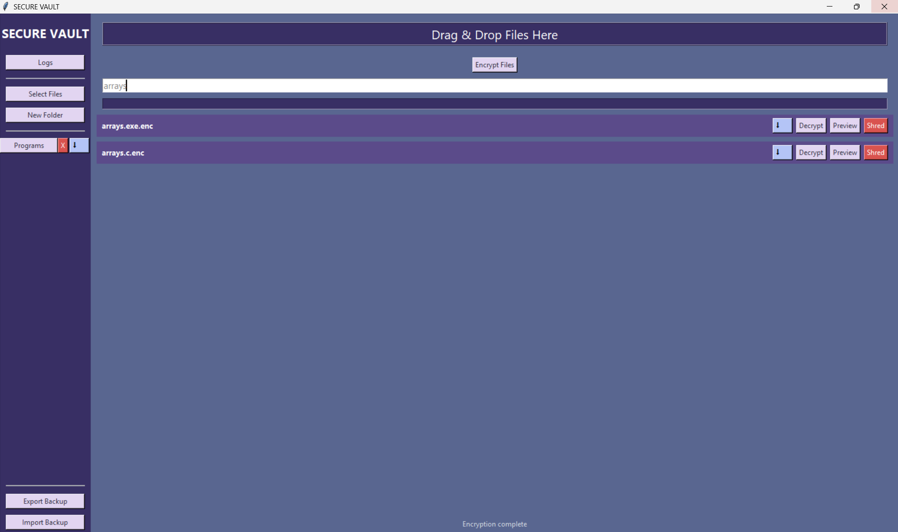
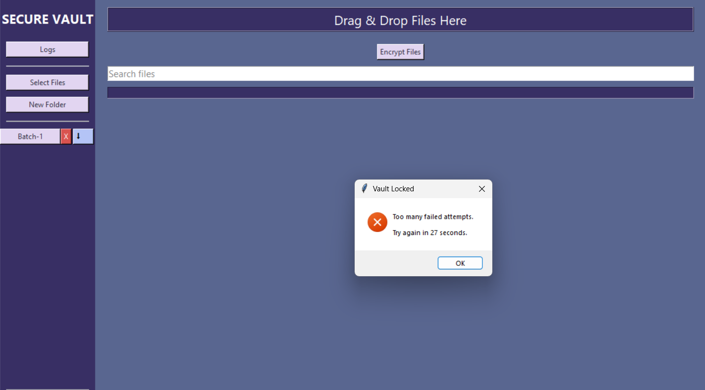
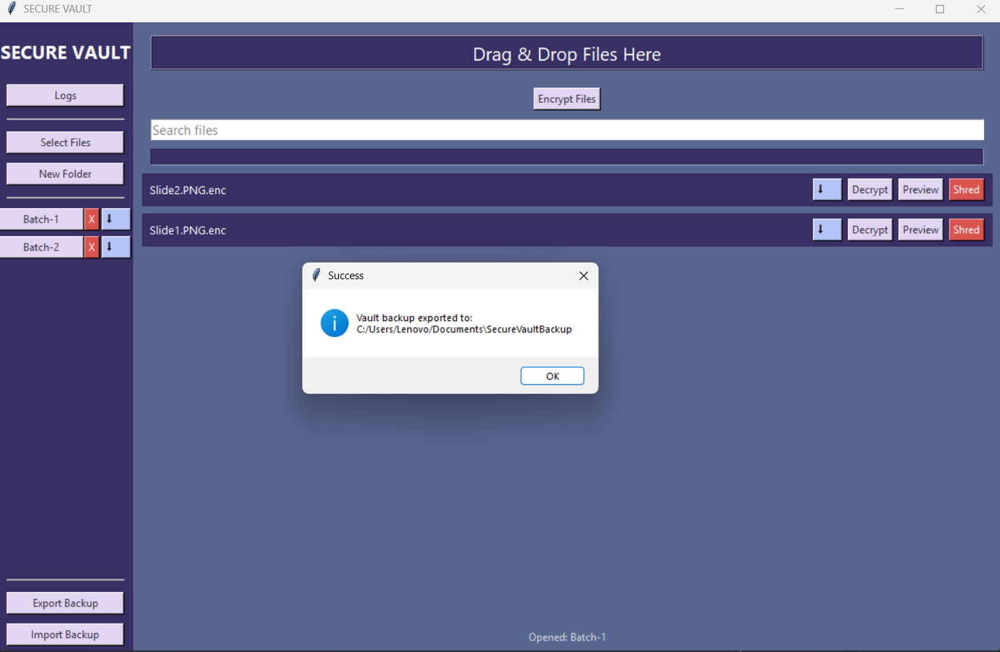

# SecureVault
### Secure Local File Encryption and Vault Management

SecureVault is a desktop-based encrypted file management system designed for secure local storage, encrypted file handling, and controlled access protection.

The application combines a Python-based desktop interface with a C/OpenSSL cryptographic backend to provide authenticated encryption, secure deletion workflows, intrusion monitoring, and encrypted recovery systems within a modular desktop architecture.

---

# Table of Contents

- [Overview](#overview)
- [Core Capabilities](#core-capabilities)
- [System Architecture](#system-architecture)
- [Security Model](#security-model)
  - [Cryptographic Security](#cryptographic-security)
  - [Vault Protection Systems](#vault-protection-systems)
- [Feature Breakdown](#feature-breakdown)
  - [Encryption Pipeline](#encryption-pipeline)
  - [Decryption Pipeline](#decryption-pipeline)
- [Technologies Used](#technologies-used)
- [Repository Structure](#repository-structure)
- [Installation](#installation)
  - [Method 1 — Download Release](#method-1--download-release)
  - [Method 2 — Build From Source](#method-2--build-from-source)
- [Packaging](#packaging)
- [Performance and Optimization](#performance-and-optimization)
- [Development Journey](#development-journey)
- [UN Sustainable Development Goals](#un-sustainable-development-goals)
- [Gallery](#gallery)
- [Future Improvements](#future-improvements)
- [Contributors](#contributors)
- [License](#license)

---

# Overview

SecureVault was developed to address:

- Unauthorized local file access
- Weak password-protected storage systems
- Insecure file deletion practices
- Lack of authenticated encryption in lightweight desktop vaults
- Poor visibility into encryption workflows and intrusion attempts

The platform focuses on strong cryptographic implementation, modular backend separation, responsive desktop usability, and practical security engineering.

---

# Core Capabilities

| Capability | Description |
|---|---|
| AES-256-GCM Encryption | Authenticated encryption with integrity validation |
| PBKDF2 Key Derivation | Password hardening using PBKDF2-HMAC-SHA256 |
| Intrusion Detection | Failed-access monitoring and vault protection |
| Secure File Shredding | Controlled irreversible deletion |
| Encrypted Recovery | Export and restoration of encrypted backups |
| Real-Time Tracking | Live encryption and decryption progress monitoring |
| Threaded Processing | Background cryptographic execution |
| Vault Search System | Live file filtering and lookup |
| Import and Export | Allows portability of data |

---

# System Architecture

```text
+---------------------------------------------------+
|                 Tkinter Desktop GUI               |
+---------------------------------------------------+
|              Python Application Layer             |
+---------------------------------------------------+
|        Vault Operations / File Management         |
+---------------------------------------------------+
|            C Encryption Backend Layer             |
+---------------------------------------------------+
|        OpenSSL AES-256-GCM Cryptography           |
+---------------------------------------------------+
```


The Python layer manages application workflows, vault state management, user interaction, and file operations.

The C backend handles cryptographic execution through OpenSSL libraries to improve encryption performance, memory handling, and cryptographic reliability.

---

# Security Model

## Cryptographic Security

- AES-256-GCM authenticated encryption
- PBKDF2-HMAC-SHA256 password key derivation
- Randomized initialization vectors
- Randomized cryptographic salts
- Authentication tag verification
- Tamper detection during decryption

---

## Vault Protection Systems

- Intrusion detection logging
- Temporary lockout protection
- Failed-attempt monitoring
- Password strength analysis
- Controlled backup recovery
- Secure overwrite-based shredding

---

# Feature Breakdown

## Encryption Pipeline

```text
User File
    ↓
Password Validation
    ↓
PBKDF2 Key Derivation
    ↓
AES-256-GCM Encryption
    ↓
Secure Vault Storage
```

---

## Decryption Pipeline

```text
Encrypted Vault File
        ↓
Password Authentication
        ↓
Authentication Tag Validation
        ↓
AES-256-GCM Decryption
        ↓
Recovered Output File
```

---

# Technologies Used

| Technology | Purpose |
|---|---|
| Python | Application logic and vault management |
| Tkinter | Desktop graphical interface |
| C | Cryptographic backend implementation |
| OpenSSL | AES-GCM and PBKDF2 cryptography |
| PyInstaller | Standalone executable packaging |
| MinGW GCC | Native backend compilation |

---

# Installation

## Method 1 — Download Release

1. Download SecureVault_Setup.exe from Releases  
2. Run the installer  
3. Launch SecureVault from Desktop or Start Menu  
4. If Windows SmartScreen appears:

```text
More Info → Run Anyway
```

---

## Method 2 — Build From Source

### Clone Repository

```bash
git clone https://github.com/yourusername/securevault.git
cd securevault
```

---

### Build Encryption Backend

```bash
mingw32-make clean
mingw32-make
```

Generated binary:

```text
build/encryptor.exe
```

---

### Install Python Dependencies

```bash
pip install -r requirements.txt
```

---

### Run Application

```bash
python gui/app.py
```

---

# Packaging

## Clean Previous Builds

```powershell
Remove-Item -Recurse -Force dist
Remove-Item -Recurse -Force build
Remove-Item -Force *.spec
```

---

## Generate Executable

```powershell
pyinstaller --onefile --windowed --icon=svicon.ico gui/app.py
```

---

## Copy Encryption Backend

```powershell
Copy-Item build\encryptor.exe dist\encryptor.exe
```

---

# Performance and Optimization

- Background threaded encryption execution
- Reduced UI blocking during cryptographic operations
- Native OpenSSL-backed encryption performance
- Modular subsystem separation
- Live progress tracking architecture
- Lightweight desktop deployment model

---

# Development Journey

## Week 1

1. The Rough Draft: An [initial summary](challenges/InitialSummary.pdf) was drafted.
2. Tech Justification: We finalized our [tech stack](challenges/TechStack.pdf)
3. The Logic Flow Architecture: An initial wireframe was created.

---

## Week 2

1. The Motivation Track: We submitted a [playlist](https://youtu.be/2wOGbtfzyQg?si=6IM9DhCG-AUuzwGx) that suited our workflow.
2. The Repo setup: Hence this repository was made!
3. The UI/Circuit Milestone: a screenshot of our initial ui was submitted.
4. The Heart of the Project: a [demo video](challenges/demo1.mp4) of our project's core logic was shared. 
---

## Week 3

1. The Code Meme & Team Identity: We submitted a meme template to share our build experience. 
2. The Global Impact Mapping: A draft of our the [SDGs](challenges/SDG.pdf) our project addresses was created.
3. The Core Error Handling: The core [error handling](challenges/errorhandling.pdf) was documented.
5. The Optimization Milestone: A [demo video](challenges/demo2.mp4) of our optimizations was submitted.

---

## Week 4

1. The Code Contribution & Cleanup Check: A link to our repository was shared.
3. The "Shark Tank" Pitch Tagline & Poster: A [poster](challenges/poster.jpg) for our project was created.
4.  The SDLC Lifecycle Mapping: A [SDLC](challenges/SDLCreport.pdf) ocument was drafted.
5.  The Production-Ready Technical README: Our README was finalized.

---

# UN Sustainable Development Goals

## SDG 9 — Industry, Innovation and Infrastructure

SecureVault promotes secure and resilient digital infrastructure through modular cybersecurity-focused desktop software engineering and modern cryptographic implementation.

---

## SDG 16 — Peace, Justice and Strong Institutions

SecureVault supports secure information management practices by helping users protect sensitive local files against unauthorized access, insecure deletion, and data exposure.

---

# Gallery

## Main Dashboard



---

## Live File Search



---

## Vault Lockout Protection



---

## Exporting Files



---

# Future Improvements

- Biometric authentication
- Cloud synchronization
- Multi-device vaults
- Secure sharing


---

# Contributors

<p align="center">
  
</p>

<p align="center">
  Developed by <strong>Team Cipher Syndicate</strong>
</p>

<p align="center">
  <a href="https://github.com/faizahhafeez2-code">@faizahhafeez2-code</a><br>
  <a href="https://github.com/silasiel">@silasiel</a><br>
  <a href="https://github.com/sakinastlw110">@sakinastlw110</a>
</p>

---

# License

This project is intended for educational and academic purposes unless otherwise specified
